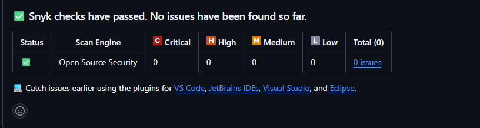

# Quality Tools

- SonarLint should be enabled in the IDE for continuous code analysis.
- SonarCloud is configured for repository scanning on `main` and pull requests.
- Snyk is configured for vulnerability scanning on `main` and weekly schedules.

## Vulnerability Analysis

A full scan of the project on `main` confirmed no open vulnerabilities:

